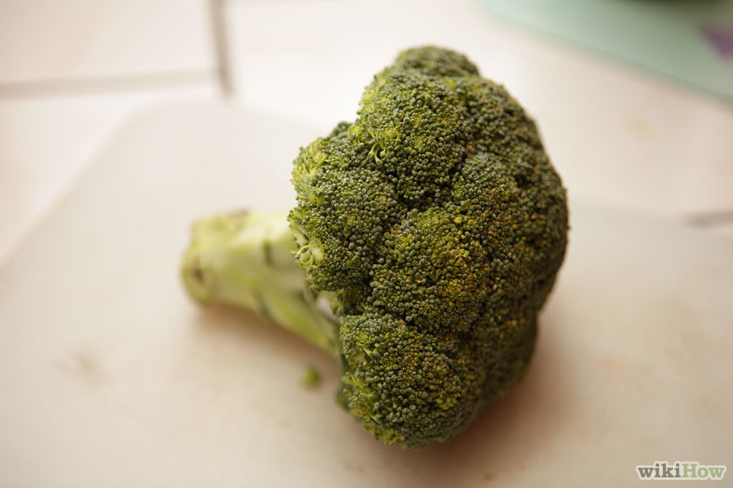
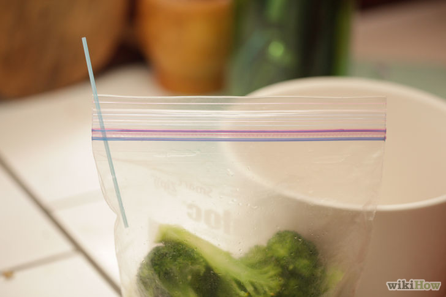
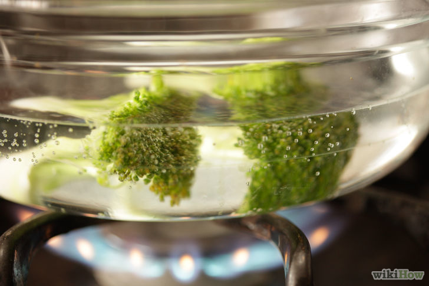
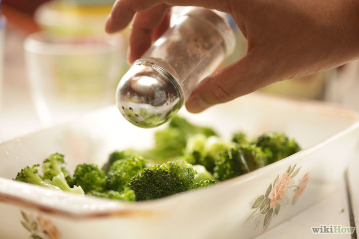

#  Brócolis

O brócolis fresco atinge sua alta temporada em meados do verão, mas se você congelá-lo, você pode aproveitar esse saudável vegetal verde o ano inteiro. Congelar brócolis é um processo fácil e você descobrirá que o brócolis que você congelar tem um sabor e uma textura muito melhores do que aquele que você compra no supermercado. Continue lendo para um guia de como congelar brócolis e aproveitá-lo de três maneiras diferentes: fervido, assado ou num ensopado.

## Congelando o Brócolis

1. **Colha ou compre brócolis**. Escolha o brócolis na alta temporada, em Janeiro ou Fevereiro. Procure por brócolis com ramos verdes e apertados que não tenham começado a separar ou ficarem amarelos. Evite os brócolis com pontos marrons ou machucados. 

1. **Lave o brócolis**. Certifique-se de remover qualquer sujeira, inseto ou traços de pesticidas. 

  - Se você vive em um área onde as pestes ou insetos do brócolis são um problema, prepare um banho de água salgada e deixe o brócolis nessa mistura por meia hora. Isso irá matar os insetos e fazer com que eles subam para a superfície. Descarte a água com sal, enxague o brócolis e continue.

  

  - Remova todas as folhas do brócolis.

  

3. **Corte o brócolis em ramos de cerca de 2,5cm de comprimento**. Corte o caule inferior em partes de 0,6cm de espessura. Descarte a parte amadeirada do caule. 

4. **Coloque o brócolis em uma tigela e cubra com água**. Esprema o suco de meio limão, mexa e deixa descansar por 5 minutos. Coloque a água com limão em uma panela . 

5. **Adicione mais água à panela**. Usando um cesto para cozimento à vapor como medida, adicione água o suficiente para que o cesto fique cerca de 2,5cm acima da água. Remova o cesto depois de verificar o nível da água. 

  - Se você não tiver um cesto para cozimento á vapor, adicione água o bastante para cobrir a quantidade de brócolis que você está processando.

6. **Cubra a panela e deixe a água ferver bem**. Cobrir a panela com uma tampa faz com que a água ferva mais rapidamente e conserva energia. 

7. **Coloque o brócolis no cesto de cozimento à vapor e ponha ele na panela**. Cubra a panela e deixe em fervura alta. Assim que a fervura continuar, cozinhe à vapor o brócolis por 5 minutos. 

  - Se você não estiver usando um cesto de cozimento à vapor, coloque o brócolis diretamente na água fervente. Escalde por dois minutos, depois remova usando uma colher com furos.

8. **Remova o cesto de cozimento à vapor e resfrie imediatamente o brócolis**. Coloque em água fria corrente ou coloque em uma bacia com água e gelo. 

  - Se você não estiver usando um cesto de cozimento à vapor, transfira o brócolis diretamente da panela para um escorredor, depois resfrie.

9. **Drene o brócolis**. Use o cesto de cozimento à vapor, ou derrame o brócolis diretamente para um escorredor. Balance para remover o excesso de água. 

10. **Divida o brócolis em porções e coloque em saquinhos plásticos para congelador**. Ponha no congelador. 

  - Coloque em cada saquinho brócolis o suficiente para uma refeição para sua família. Desta maneira, você poderá descongelar exatamente a quantidade necessária, ao invés de brócolis em excesso. Uma medida imprecisa é um punhado de ramos por refeição.

  

  - Se você não estiver usando um selador à vácuo, feche o saquinho quase completamente. Coloque um canudo na abertura. Remova o ar restante através do canudo. Remova o canudo enquanto termina de selar o saquinho.

  

  - Rotule os saquinhos com a data de congelamento. Use em até 9 meses para um melhor sabor e valor nutricional.

  

## Cozinhando Rapidamente Brócolis Congelado

1. **Ponha uma panela grande com água para frever em fogo alto**. É importante usar uma panela grande, já que você não quer que o brócolis fique na água por muito tempo. Uma panela menor irá esfriar mais rapidamente quando o brócolis congelado for adicionado e levará mais tempo para cozinhá-lo. 

2. **Remova o brócolis do congelador**. Ele pode ou não ter congelado em um amontoado só; de qualquer maneira está bom. 

3. **Adicione o brócolis na água fervente**. Remova depois de um minuto a noventa segundos - é esse o tempo necessário para reconstituir o brócolis congelado. 

  - Cozinhar o brócolis por mais do que um minuto e meio fará com que ele fique ensopado e se despedace.
  
  

  - Certifique-se de não adicionar o brócolis na água até que ela esteja fervendo completamente.

  

4. **Seque a água do brócolis**. Ponha o brócolis em uma tigela e tempere com manteiga, sal, pimenta e queijo se desejar. 

## Assando o Brócolis

1. **Preaqueça o forno a 218ºC**.

2. **Remova o brócolis do congelador**. Espalhe igualmente em uma travessa para forno. Se o brócolis tiver congelado em um amontoado, use um garfo e faca para separá-lo. 

3. **Cubra levemente o brócolis com azeite de oliva**. Óleo de gergelim ou de uva também funcionam bem. 

4. **Tempere o brócolis com sal e pimenta**. Salpique com temperos adicionais como pimenta caiena, páprica, alho em pó ou cominho se quiser. 

5. **Coloque o brócolis no forno**. Cozinhe por 15 minutos, ou até que os ramos de brócolis estejam dourados e crocantes. 

6. **Remova o brócolis do forno**. Coloque em uma tigela e sirva quente. 

## Dicas

- Os vegetais ficarão mais saborosos e crocantes se secos antes de congelar; evite congelá-los úmidos.
- Usar limão irá manter o brócolis verde vivo mesmo depois de cozinhá-lo.
- Um cesto para cozimento a vapor com alças é mais fácil de usar do que um sem, já que o cesto com alça pode ser colocado e removido da panela à vapor com o brócolis dentro.

## Avisos

- Não escalde no microondas.
- Tome cuidado quando estiver cozinhando com vapor. Use uma luva para cozinha quando remover as tampas das panelas e quando estiver removendo o cesto de cozimento a vapor. Não ponha o rosto diretamente acima de uma panela de cozimento a vapor.
- Corte os vegetais em tábuas separadas que não sejam usadas para cortar carne crua.
